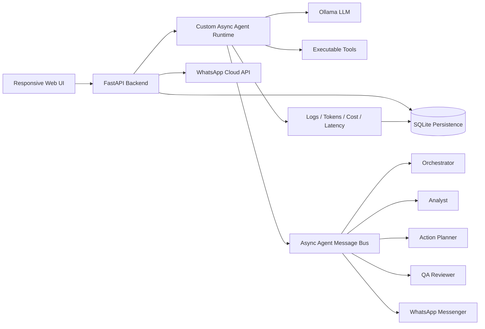

# AgentBridge AI Studio

AgentBridge AI Studio is a local, open-source, **LLM-only AI Agent Orchestration Platform** built around: configurable agents, real tool execution, asynchronous multi-agent workflows, persistent history, visual workflow management, WhatsApp integration, live monitoring, and documentation.

Developed by **Azhar** · LinkedIn: https://www.linkedin.com/in/azhar786

## Requirement mapping

| Challenge requirement | Implementation |
|---|---|
| Agent CRUD | UI + REST APIs to create, list, update, and delete agents |
| Agent configuration | Name, role, system prompt, model, tools, channels, schedules, memory, skills, interaction rules, guardrails |
| Real runtime | Custom async LLM-only runtime using Ollama; tools execute before LLM generation |
| Async communication | `asyncio.Queue`-based inter-agent message bus with persisted messages |
| Persistence layer | SQLite tables for agents, workflows, messages, logs, memory, metrics, integration settings |
| Web UI | Responsive single-page UI served by FastAPI |
| Visual workflow builder | Template list, stage cards, conditions, feedback loop metadata, and create-template form |
| 2+ templates | Three seeded templates: Business Update, WhatsApp Support Triage, Scheduled Follow-up |
| External messaging | WhatsApp Cloud API connector with config UI, send, test send, and webhook verification |
| Monitoring | Logs, messages, token estimates, latency, cost, and run counts |
| Tests | Pytest coverage for health, agent creation, workflow run, message delivery, WhatsApp config, webhook verification, readiness scorecard |
| Fully local setup | Runs locally with FastAPI + SQLite + Ollama |

## Specialist agents

1. **Ava Orchestrator** — classifies intent and routes the request.
2. **Ravi Task Analyst** — summarizes task context and identifies risk/tone.
3. **Tara Action Planner** — extracts action items, schedules follow-up, and drafts notifications.
4. **Noah QA Reviewer** — checks compliance, policy risk, sentiment, and safe delivery.
5. **Zoya WhatsApp Messenger** — formats final responses for WhatsApp delivery.

## Tools

- `intent_classifier`
- `limit_check`
- `summarize_text`
- `extract_action_items`
- `sentiment_check`
- `compliance_guard`
- `policy_risk_check`
- `pii_redactor`
- `schedule_parser`
- `notification_draft`
- `memory_note`
- `calculator`
- `current_time`

The final answer is generated by the LLM, but structured action items are also returned from tool traces so the UI action table updates reliably.

## Architecture



## Runtime choice

The challenge allows a custom runtime. This project uses a **custom async LLM-only runtime** because it keeps the repository simple, local, inspectable, and credential-light. Ollama provides the local open-source LLM backend. No production answer is generated by hardcoded Python fallback.

Default model:

```text
llama3.2:3b
```

## Quick start

Install Ollama first, then pull the model:

```powershell
ollama pull llama3.2:3b
```

Run the app:

```powershell
py -3.12 -m venv .venv
Set-ExecutionPolicy -Scope Process -ExecutionPolicy Bypass
.\.venv\Scripts\Activate.ps1
python -m pip install --upgrade pip
python -m pip install -r requirements.txt
$env:PYTHONPATH="."
python scripts\seed_workspace.py
python -m uvicorn app.main:app --reload --host 127.0.0.1 --port 8000
```

Open:

```text
http://127.0.0.1:8000
```

## Best walkthrough prompt

```text
Summarize this EMR project delay issue and create action items. The job failed due to memory issue, memory was increased, and final output generated successfully in S3. Prepare a manager-friendly update and include owner-level next steps.
```

## WhatsApp minimum setup

For sending an agent response to your personal WhatsApp, fill these fields in **WhatsApp Channel → Connector Setup**:

```text
Access Token
Phone Number ID
Graph API Version
Test Recipient Mobile
```

Optional for receiving replies:

```text
Verify Token
Webhook URL through ngrok/cloudflared
App Secret
```

## API examples

Health:

```bash
curl http://127.0.0.1:8000/api/health
```

Run workflow:

```bash
curl -X POST http://127.0.0.1:8000/api/workflows/1/run \
  -H "Content-Type: application/json" \
  -d '{"input":"Summarize project delay and extract action items","channel":"web"}'
```

Trigger WhatsApp channel:

```bash
curl -X POST http://127.0.0.1:8000/api/channel/message \
  -H "Content-Type: application/json" \
  -d '{"text":"Create a manager update and action items","user_id":"local-user","channel":"whatsapp","workflow_id":2}'
```

## Add a new workflow template

Use the **Create New Template** button in the UI, or POST to `/api/workflows` with nodes, edges, entry node, conditions, and feedback loop flags.

## Add a new channel

Create a new adapter endpoint that converts the external payload into `ChannelMessage` and calls `/api/channel/message` or `local_channel_message()` internally. The WhatsApp adapter in `app/main.py` is the reference implementation.
