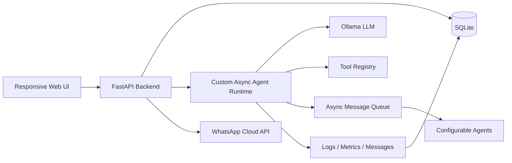

# Architecture

## Layers

| Layer | Files | Responsibility |
|---|---|---|
| UI | `app/static/index.html` | Agents, workflows, WhatsApp setup, monitoring |
| API | `app/main.py` | REST endpoints, WhatsApp webhook, readiness scorecard |
| Runtime | `app/runtime/agents.py`, `app/runtime/workflows.py` | LLM execution, tool execution, async agent routing |
| Tools | `app/runtime/tools.py` | Summarization, action extraction, compliance, scheduling, notification draft, calculator |
| Persistence | `app/db.py` | SQLite schema and data access |
| Integrations | `app/integrations/whatsapp.py` | WhatsApp Cloud API client and config handling |
